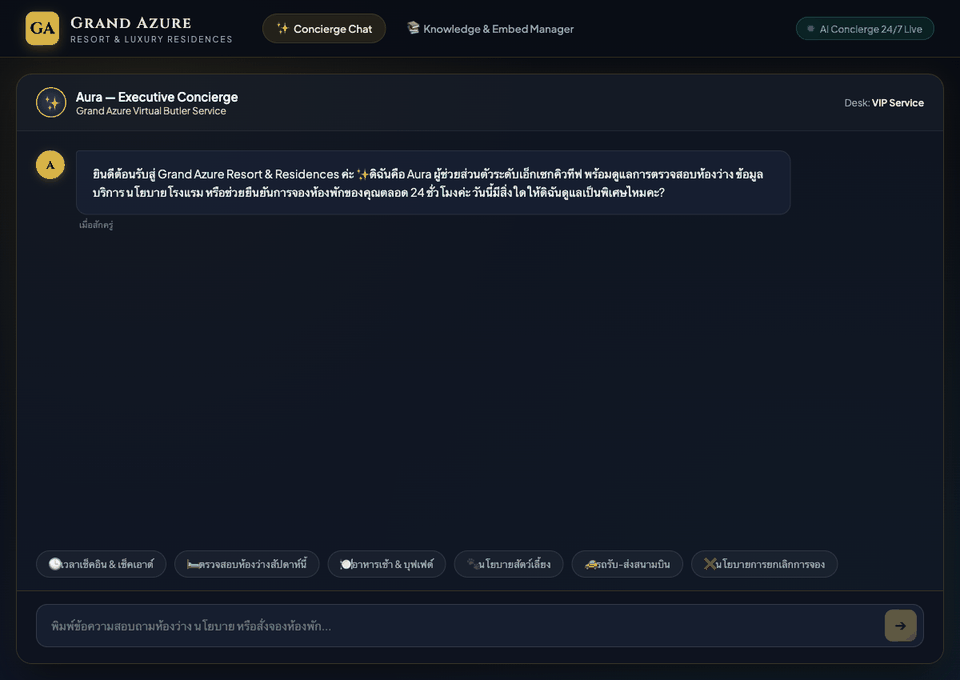

# Intelligent Concierge System (Multi-Agent Microservices)

A production-ready, multi-agent AI Concierge system built with a microservices architecture, designed for luxury hospitality (Grand Azure Resort & Residences).

---

## 🎬 Live Demonstration



*ตัวอย่างการทำงานจริงของ AI Concierge (Aura): การสอบถามนโยบายโรงแรมผ่าน Qdrant Vector RAG และการตรวจสอบประเภทห้องพักพร้อมอัตราค่าบริการแบบ Real-time Token Streaming เชื่อมโยงกับ .NET 10 Microservice*

---

## 🏛️ System Architecture

```text
┌────────────────────────────────────────────────────────┐
│                   SvelteKit Frontend                   │
│         (Svelte 5 Runes, TypeScript, Luxury UI)        │
│                        Port: 3000                      │
└───────────────────────────┬────────────────────────────┘
                            │ SSE Stream / REST
                            ▼
┌────────────────────────────────────────────────────────┐
│              Python AI Orchestrator                    │
│      (FastAPI + LangGraph Multi-Agent StateGraph)      │
│                        Port: 8000                      │
└──────┬────────────────────┬────────────────────┬───────┘
       │                    │                    │
       │ Vector Search      │ Function Calling   │ Inference
       ▼                    ▼                    ▼
┌──────────────┐     ┌──────────────┐     ┌──────────────┐
│  Qdrant DB   │     │ .NET 10 API  │     │    Ollama    │
│  (FastEmbed) │     │ (Clean Arch) │     │ (Qwen2.5 7B) │
│  Port: 6333  │     │  Port: 8080  │     │ Port: 11434  │
└──────────────┘     └──────┬───────┘     └──────────────┘
                            │ EF Core
                            ▼
                     ┌──────────────┐
                     │  MySQL 8.0   │
                     │  Port: 3306  │
                     └──────────────┘
```

---

## ⚡ Hardware Profile & Optimization (Apple Silicon M5 Pro / 16GB RAM)

- **Architecture:** All Docker containers use `linux/arm64` for native Apple Silicon performance.
- **Native GPU Acceleration (Ollama on Host):** Ollama ทำงานแบบ Native บนเครื่องโฮสต์ (ไม่ผ่าน Docker) เพื่อดึงประสิทธิภาพ Apple Metal GPU (macOS) หรือ NVIDIA CUDA ได้เต็ม 100% ทำให้ประมวลผลเร็วระดับ ~40–60+ tokens/sec และประหยัด RAM ให้คอนเทนเนอร์อื่นๆ
- **Zero VRAM Embedding Overhead:** Qdrant RAG utilizes **FastEmbed ONNX** (`BAAI/bge-small-en-v1.5`) directly inside the Python runtime, leaving 100% of GPU VRAM dedicated to the `qwen2.5:7b` chat model without model swapping.

---

## 📁 Monorepo Structure

```text
hotel_agent/
├── docker-compose.yml           # Root multi-container orchestrator
├── .env.example                 # Environment variables specification
├── .env                         # Active environment configuration
├── CHANGELOG.md                 # Semantic Versioning (SemVer) log
├── scripts/
│   └── pull-model.sh            # Utility script to pull qwen2.5:7b into Ollama
├── backend-dotnet/              # Core Business Logic (.NET 10 Web API)
│   ├── Controllers/             # Rooms & Bookings REST controllers
│   ├── Services/                # Business services with Result pattern
│   ├── Repositories/            # EF Core data access layer
│   ├── Models/ & DTOs/          # Domain entities (Room, Booking) & contracts
│   ├── Data/                    # HotelDbContext & auto-seeding logic
│   └── Dockerfile               # Multi-stage build (sdk:10.0 -> aspnet:10.0)
├── ai-orchestrator/             # Multi-Agent Orchestrator (FastAPI + LangGraph)
│   ├── graph/                   # StateGraph (Router, RAG, Tool, Generator)
│   ├── rag/                     # Qdrant client & FastEmbed auto-seeder
│   ├── tools/                   # HTTP client for .NET API integration
│   ├── data/                    # Hotel policies dataset
│   ├── schemas.py & state.py    # Pydantic schemas & AgentState TypedDict
│   ├── main.py                  # FastAPI app with SSE streaming endpoint (/chat)
│   └── Dockerfile               # Python 3.11-slim container
└── frontend/                    # Modern Guest Interface (SvelteKit + Svelte 5)
    ├── src/lib/components/      # Luxury UI components (Cards, Chips, Chat)
    ├── src/routes/+page.svelte  # SSE stream consumer & reactive chat desk
    ├── vite.config.ts           # Configured with @sveltejs/adapter-node
    └── Dockerfile               # Multi-stage build (node:20-alpine)
```

---

## 🛠️ คู่มือการติดตั้งและเริ่มต้นใช้งาน (Installation & Setup Guide)

### 1. สิ่งที่ต้องเตรียมพร้อม (Prerequisites)

- **ระบบปฏิบัติการ:** macOS (Apple Silicon M1/M2/M3/M4/M5 แนะนำ), Linux หรือ Windows (WSL2)
- **หน่วยความจำ (RAM):** แนะนำ 16GB ขึ้นไป (สำหรับรันโมเดล 7B–8B ควบคู่กับ Microservices ทั้งหมด)
- **เครื่องมือที่ต้องติดตั้ง:**
  - [Ollama](https://ollama.com/) (ติดตั้งบน Host เพื่อเปิดใช้งาน GPU Hardware Acceleration โดยไม่ต้องรันใน Docker)
  - [Docker Desktop](https://www.docker.com/products/docker-desktop/) หรือ Docker Engine + Docker Compose (v2.20+)
  - [Git](https://git-scm.com/)

---

### 2. ขั้นตอนการติดตั้งและเริ่มต้นใช้งานระบบ (Installation & Setup Guide)

สถาปัตยกรรมระบบได้รับการออกแบบให้รัน **Ollama บน Host โดยตรง (ไม่ใช้ Docker)** เพื่อความเร็วระดับ GPU Native สูงสุด และรัน Microservices อื่นๆ ทั้งหมดผ่าน **Docker Compose**:

#### ขั้นตอนที่ 1: ติดตั้ง Ollama บน Host และดาวน์โหลดโมเดล
ติดตั้ง Ollama ตามระบบปฏิบัติการของคุณ:
- **macOS:**
  ```bash
  brew install ollama
  ```
  *(หรือดาวน์โหลดจาก [ollama.com/download](https://ollama.com/download))*
- **Linux:**
  ```bash
  curl -fsSL https://ollama.com/install.sh | sh
  ```

จากนั้นเริ่มต้นบริการ Ollama และดาวน์โหลดโมเดล LLM (`qwen2.5:7b`):
```bash
ollama run qwen2.5:7b
```
*(เมื่อโมเดลโหลดเสร็จ สามารถพิมพ์ `/bye` เพื่อออกจาก Interactive Console โดยบริการ Ollama จะยังคงทำงานเป็น Background Service พร้อมรับ Request ที่พอร์ต `11434`)*

#### ขั้นตอนที่ 2: เตรียม Environment Configuration
คัดลอกไฟล์ `.env.example` เป็น `.env` (ระบบตั้งค่าเชื่อมต่อกับ Host Native Ollama ผ่าน `http://host.docker.internal:11434` เป็นค่าตั้งต้นไว้แล้ว):
```bash
cp .env.example .env
```

#### ขั้นตอนที่ 3: สั่ง Build และรัน Microservices ทั้งหมดใน Background
```bash
docker compose up -d --build
```
> คำสั่งนี้จะ Build และเริ่มทำงานคอนเทนเนอร์ 5 บริการ (MySQL, Qdrant, .NET 10 API, AI Orchestrator, SvelteKit Frontend) โดยอัตโนมัติ

#### ขั้นตอนที่ 4: ตรวจสอบสถานะการทำงานของระบบ
```bash
docker compose ps
```
> รอจนกระทั่งสถานะของ `hotel-mysql` และ `hotel-qdrant` เปลี่ยนเป็น `healthy` โดยคอนเทนเนอร์ `.NET 10` และ `FastAPI` จะต่อคิวเริ่มทำงานตามลำดับความขึ้นตรง (Healthcheck Dependencies) โดยอัตโนมัติ

---

### 3. URL และพอร์ตการเข้าใช้งานระบบ (Service Entrypoints)

เมื่อทุกบริการทำงานเรียบร้อยแล้ว สามารถเข้าใช้งานผ่านเบราว์เซอร์ได้ที่:

| Service | Port | Local URL | รายละเอียด |
| :--- | :--- | :--- | :--- |
| **SvelteKit Chat UI** | `3000` | [http://localhost:3000](http://localhost:3000) | หน้าจอแชต VIP Concierge แบบหรูหรา 5 ดาว พร้อมสตรีม SSE |
| **Knowledge & Embed Manager** | `3000` | [http://localhost:3000/admin/knowledge](http://localhost:3000/admin/knowledge) | หน้า Admin สำหรับจัดการเนื้อหา, สั่งทำ Embeddings และทดสอบ Vector Search |
| **AI Orchestrator Docs** | `8000` | [http://localhost:8000/docs](http://localhost:8000/docs) | Swagger UI สำหรับทดสอบ API LangGraph, RAG, และ Tool Calling |
| **.NET 10 Web API** | `8080` | [http://localhost:8080/health](http://localhost:8080/health) | Core Business Logic (.NET 10 API) จัดการห้องพักและการจอง |
| **Qdrant Vector Dashboard** | `6333` | [http://localhost:6333/dashboard](http://localhost:6333/dashboard) | Web Console ตรวจสอบ Vector Points & Collection (`hotel_policies`) |
| **MySQL Relational DB** | `3306` | `localhost:3306` | ฐานข้อมูลห้องพักและการจอง (`hotel_db` / user: `hotel_user`) |
| **Ollama Local LLM** | `11434` | [http://localhost:11434](http://localhost:11434) | Host Native LLM (Qwen2.5 7B with Metal GPU / CUDA) |

---

### 4. คำสั่งจัดการที่ใช้บ่อย (Useful Operational Commands)

- **ตรวจสอบสถานะ Native Ollama และโมเดล:**
  ```bash
  ollama list
  ```
- **ดู Logs การทำงานของ AI Orchestrator:**
  ```bash
  docker compose logs -f ai-agent
  ```
- **ดู Logs การทำงานของ .NET API:**
  ```bash
  docker compose logs -f dotnet-api
  ```
- **หยุดการทำงานของระบบชั่วคราว:**
  ```bash
  docker compose stop
  ```
- **ปิดระบบและลบคอนเทนเนอร์:**
  ```bash
  docker compose down
  ```
- **ล้างระบบและข้อมูลใน Volumes ทั้งหมด (Clean Reset):**
  ```bash
  docker compose down -v
  ```

---

## 🌿 Git Flow Branching & Release Management

This repository adheres to **Git Flow** and **Semantic Versioning (SemVer)**:
- `main`: Production-ready release branch (tagged `v0.1.0`).
- `develop`: Integration branch for upcoming features.
- `feature/concierge-core`: Current active development branch.
